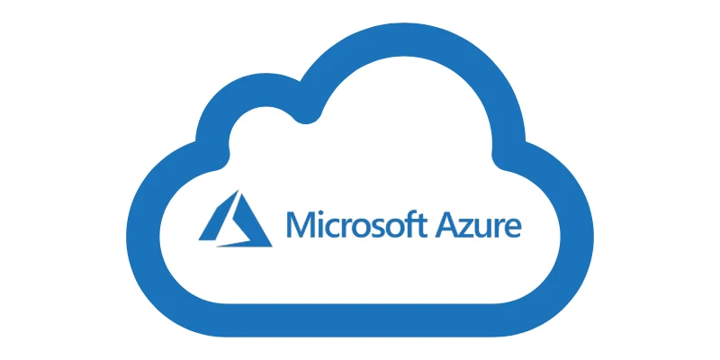

  

# AZ-900
## Introduction

* **Machine virtuelle** : 
  Elle contient :
  * Des matériels virtuels
  * Un système d'exploitation
  * Des applications
  
  Tout cela communique avec l'hyperviseur, qui lui-même communique avec l'OS de l'hôte.

* **Conteneur** : 
  Il contient :
  * Uniquement des applications et leurs dépendances
  
  Ces éléments communiquent avec le moteur de conteneurs, qui lui-même communique avec l'OS de l'hôte. Ces applications ne dépendent pas du système d'exploitation de l'hôte, ce qui rend leur exécution beaucoup plus rapide et légère que celle des machines virtuelles.

* **Serverless** : 
  Modèle où le fournisseur gère entièrement l'infrastructure et l'allocation des ressources. Vous ne déployez que le code source, et le système s'exécute uniquement à la demande, sans qu'aucun serveur ne soit à gérer ou à payer en continu.

---

## Les Avantages du Cloud

### **Économique**
Ce qui est intéressant avec le cloud, c'est qu'on utilise et qu'on ne paie que ce dont on a besoin. En d'autres termes, si la machine virtuelle est arrêtée, on ne paie que le stockage, car nos données doivent nécessairement être conservées quelque part.

### **Scalable**
* **Scale-up (Mise à l'échelle verticale)** : Consiste à rajouter de la puissance (CPU, RAM) aux ressources matérielles existantes pour améliorer les performances de l'application.
* **Scale-out (Mise à l'échelle horizontale)** : Consiste à rajouter plusieurs serveurs qui agissent ensemble comme un serveur unique (via le partage des tâches) pour optimiser les performances.

### **Élasticité**
C'est la capacité du système à gérer automatiquement l'augmentation ou la diminution des ressources en fonction de la charge de travail. Autrement dit, si votre application a besoin de plus de mémoire pour gérer un pic d'utilisateurs, le cloud s'adapte instantanément, et fait de même dans le sens inverse.

### **Mise à jour**
Le cloud prend en charge toute la gestion matérielle et les mises à jour. Si un composant (comme un disque dur) tombe en panne, le fournisseur s'en charge, tout comme pour les pilotes et les correctifs système. L'application reste ainsi disponible en continu dans les meilleures conditions.

### **Mondial**
Les serveurs effectuent des redondances de données sur plusieurs zones géographiques afin d'offrir une rapidité d'accès optimale au client final et d'éviter toute perte de données.

### **Sécurité**
Le fournisseur gère à la fois la sécurité physique (accès aux datacenters, caméras) et la sécurité logique (contrôle des accès aux données numériques). Cela décharge totalement l'entreprise de cette lourde charge.

### **Coût et flexibilité**
L'un des arguments les plus puissants du cloud est l'adaptabilité des ressources en temps réel. Le système ajuste la capacité au plus près de la demande exacte de l'application : fini les dépenses superflues ou les manques de ressources. 
À l'inverse, en gérant ses propres serveurs physiques, il est nécessaire de dimensionner l'infrastructure à l'avance de manière approximative pour le long terme, ce qui entraîne des incertitudes sur la consommation réelle. C'est précisément là que réside toute la force des solutions cloud comme Azure.

---

## Les Différents Types de Cloud

### **1. Cloud public (ex. : Azure)**
Il bénéficie de tous les avantages du cloud mentionnés précédemment. En contrepartie, il peut présenter quelques contraintes : par exemple, le fait que les données transitent à travers différents pays peut poser des questions de conformité pour certains clients, et vous dépendez de l'architecture standard du fournisseur.

### **2. Cloud privé (local)**
Son principal atout est sa sécurité renforcée : la configuration et le contrôle de la transition des données sont entièrement maîtrisés en interne. 
Ses inconvénients majeurs résident dans les coûts d'investissement initiaux, ainsi que dans le besoin d'équipements, d'énergie et de compétences techniques pointues pour le maintenir.

### **3. Cloud hybride**
Il combine les avantages des deux approches : les données et traitements hautement sensibles sont gérés par le cloud privé, tandis que les charges moins critiques profitent de la souplesse du cloud public. L'ensemble fonctionne grâce à une communication sécurisée entre les deux environnements. 
Son point faible est qu'il exige davantage de ressources et d'expertise pour orchestrer cette interopérabilité.

---

## Les Types de Services

* ***IaaS* (Infrastructure as a Service) :** Location d'infrastructures virtuelles brutes (serveurs, stockage). C'est à l'utilisateur de gérer entièrement l'OS, les pare-feux, la sécurité et les mises à jour.
* ***PaaS* (Platform as a Service) :** Contrairement à l'IaaS, le fournisseur prend en charge la gestion de l'OS, de la sécurité et des mises à jour. L'équipe de développement peut ainsi se concentrer exclusivement sur la création et le déploiement de l'application.
* ***SaaS* (Software as a Service) :** Solutions logicielles entièrement gérées par le fournisseur (ex. : YouTube, Outlook, GitHub). Aucune installation ni maintenance technique n'est requise de la part de l'utilisateur : il suffit de se connecter et d'utiliser le service.